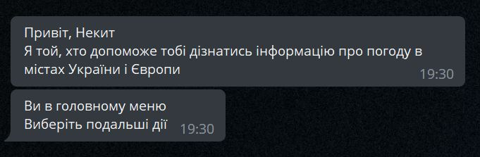

_Bot for showing information about the weather in cities around the world_

### Demo

Click **<a href="https://t.me/WeatherGubchikBot" target="_blank">here</a>** to open telegram WeatherGubchikBot

### Project modules (requirements.txt)

          

---

### Features

1. 

Emoji
I use RegExp for getting emoji by weather description

2. 

Daily mailing
You can sign up for the mailing to receive daily weather information in the city of your choice (you can turn it off at any time)

3. 

Storing in database
If you sign up for the newsletter, information will store in PostgreSQL database

### Three languages (screenshots)

**UA**  
  
**EN**  
  
**RU**  
  

            
### License

[WeatherGubchikBot](https://github.com/Gubchik123/WeatherGubchikBot) is licensed under the [MIT License](https://github.com/Gubchik123/WeatherGubchikBot/blob/master/LICENSE.md).