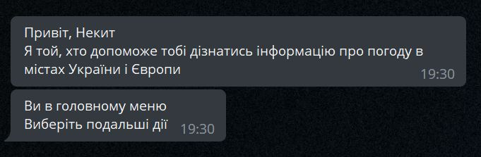
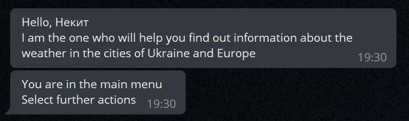
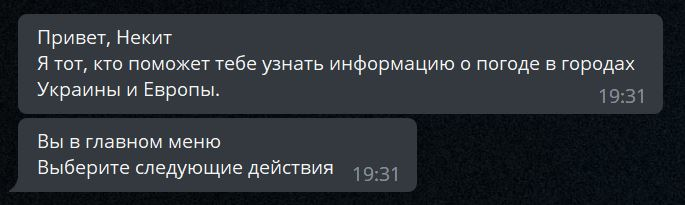

<a href="https://t.me/WeatherGubchikBot" target="blank"></a>
*Bot for showing information about the weather in cities of Ukraine and Europe*

### Demo
Click **<a href="https://t.me/WeatherGubchikBot" target="blank">here</a>** to open telegram WeatherGubchikBot

---

### Features

1. <details><summary>Emoji</summary>I use RegExp for getting emoji by weather description</details>
2. <details><summary>Daily mailing</summary>You can sign up for the mailing to receive daily weather information in the city of your choice (you can turn it off at any time)</details>
3. <details><summary>Storing in database</summary>If you sign up for the newsletter, information will store in PostgreSQL database</details>
4. <details><summary>Using fuzzy comparison</summary>You can type the title of the city and bot try to find it with using python fuzzywuzyy module for fuzzy comparison</details>

### Multilanguage (screenshots)
**UA** <br>

**EN** <br>

**RU** <br>


### Environment Variables

To run this project, you will need to add the following environment variables to your .env file

`DB_URI`
`BOT_TOKEN`

### Run Locally

Clone the project
```
  git clone https://github.com/Gubchik123/WeatherGubchikBot.git
```

Go to the project directory
```
  cd WeatherGubchikBot
```

Install dependencies
```
  pip install -r requirements.txt
```

Start the server
```
  python bot/bot.py
```

> **Note:** Don't forget about environment variables

### Connect with me
<p align="left">
<a href="https://stackoverflow.com/users/20199410" target="blank"></a>
<a href="https://instagram.com/nikitos.1746" target="blank"></a>
<a href="https://t.me/Gubchik123" target="blank"></a>
</p>
