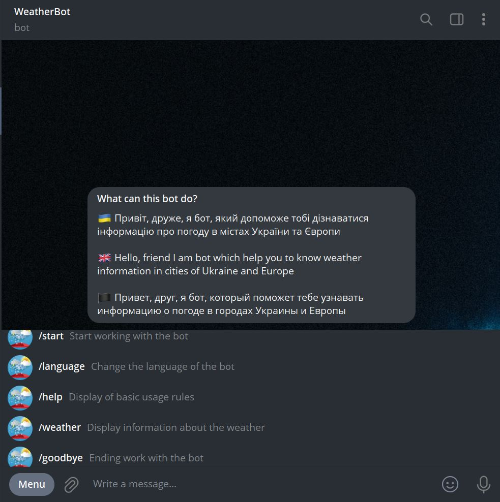

<a href="https://t.me/WeatherGubchikBot" target="_blank"></a>
_Bot for showing information about the weather in cities of Ukraine and Europe_

### Demo

Click **<a href="https://t.me/WeatherGubchikBot" target="_blank">here</a>** to open telegram WeatherGubchikBot



### Project modules (requirements.txt)

<a href='https://pypi.org/project/aiogram'></a> <a href='https://pypi.org/project/asyncio'></a> <a href='https://pypi.org/project/APScheduler'></a> <a href='https://pypi.org/project/beautifulsoup4'></a> <a href='https://pypi.org/project/lxml'></a> <a href='https://pypi.org/project/emoji'></a> <a href='https://pypi.org/project/fuzzywuzzy'></a> <a href='https://pypi.org/project/fake-useragent'></a> <a href='https://pypi.org/project/psycopg2'></a> <a href='https://pypi.org/project/python-dotenv'></a> <a href='https://pypi.org/project/python-Levenshtein'></a> <a href='https://pypi.org/project/pytz'></a> <a href='https://pypi.org/project/requests'></a>

---

### Features

1. <details><summary>Emoji</summary>I use RegExp for getting emoji by weather description</details>
2. <details><summary>Daily mailing</summary>You can sign up for the mailing to receive daily weather information in the city of your choice (you can turn it off at any time)</details>
3. <details><summary>Storing in database</summary>If you sign up for the newsletter, information will store in PostgreSQL database</details>
4. <details><summary>Using fuzzy comparison</summary>You can type the title of the city and bot try to find it with using python fuzzywuzyy module for fuzzy comparison</details>

### Three languages (screenshots)

**UA** <br>
 <br>
**EN** <br>
 <br>
**RU** <br>
 <br>

### Environment Variables

To run this project, you will need to add the following environment variables to your .env file

`DB_URI`
`TIMEZONE`
`BOT_TOKEN`
`MY_TELEGRAM_CHAT_ID`

### Run Locally

Clone the project

```
  git clone https://github.com/Gubchik123/WeatherGubchikBot.git
```

Go to the project directory

```
  cd WeatherGubchikBot
```

Install dependencies

```
  pip install -r requirements.txt
```

Run the bot

```
  python bot/bot.py
```

> **Note:** Don't forget about environment variables
